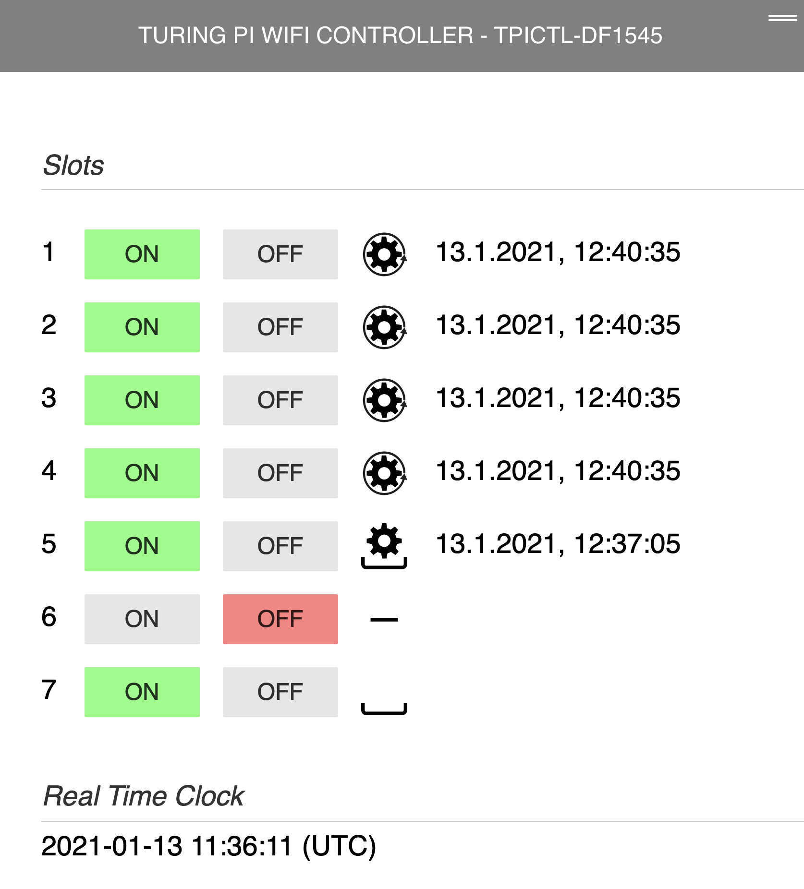
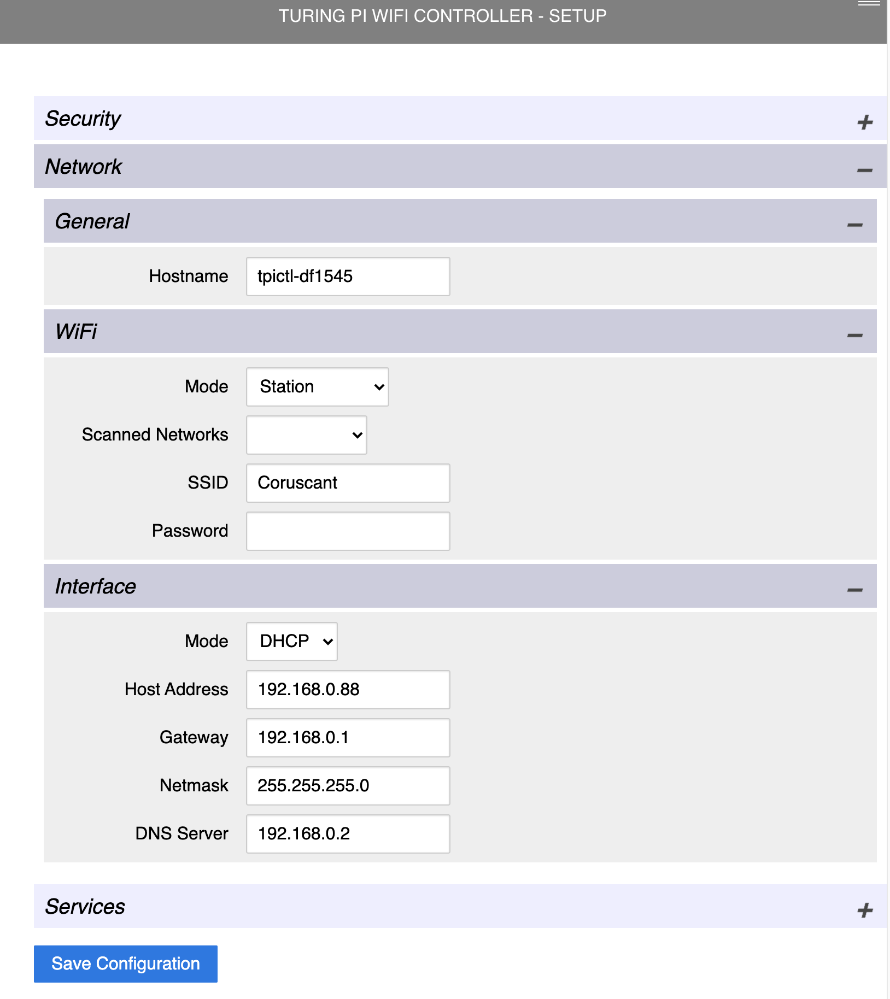
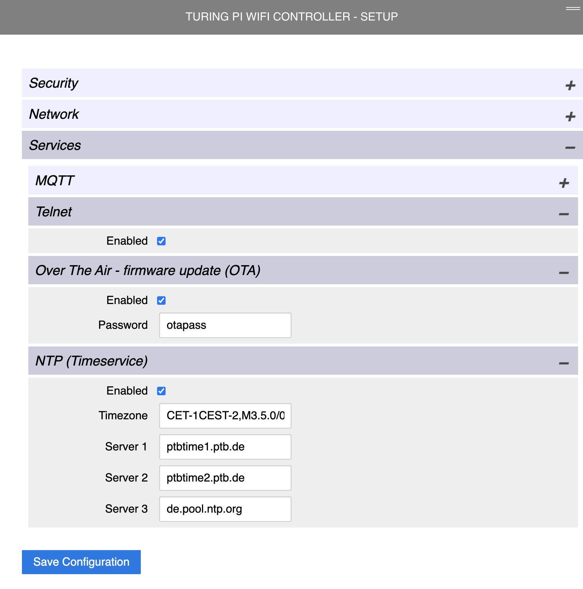
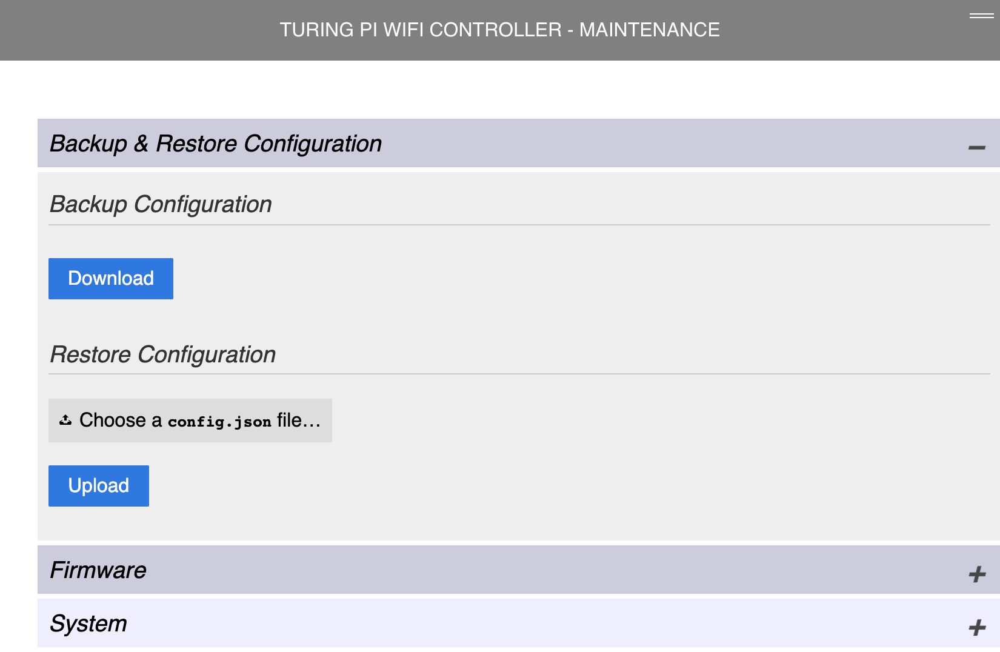
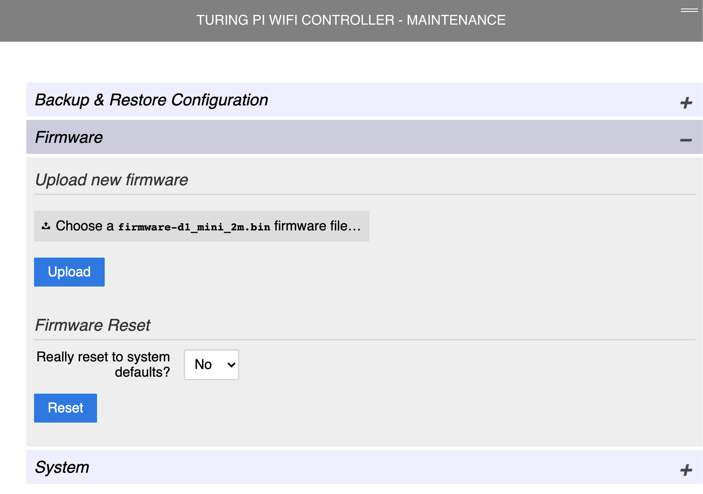
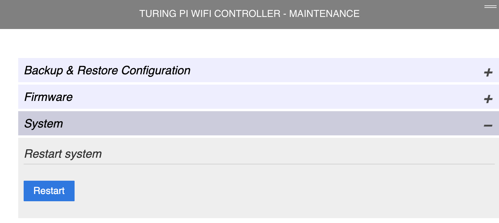
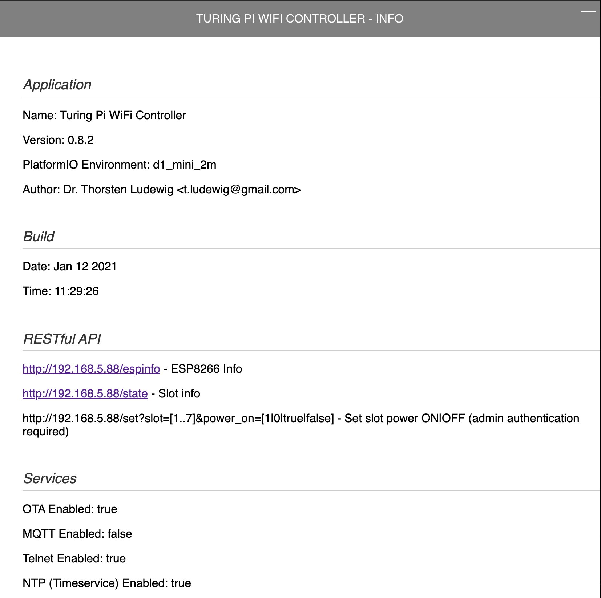

# Documentation

## Root page

## Setup

### Admin password

### Network settings

## Services

## Maintenance

### Backup & Restore Configuration

### Firmware

### Restart System

## Info Page

